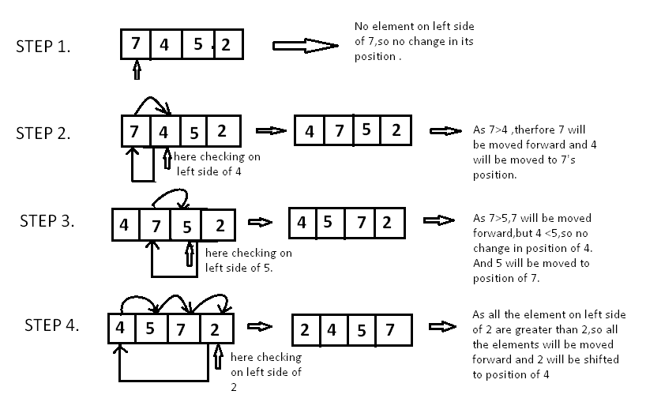

## 1. Insertion Sort



### Idea

Insertion Sort works the same way you sort playing cards in your hand.

* Take one element at a time
* Insert it into its **correct position** in the already sorted part of the array

### How it works

1. Assume the first element is already sorted
2. Take the next element
3. Shift larger elements to the right
4. Insert the element at the correct position

### Python Implementation

```python
def insertion_sort(arr):
    for i in range(1, len(arr)):
        key = arr[i]
        j = i - 1

        while j >= 0 and arr[j] > key:
            arr[j + 1] = arr[j]
            j -= 1

        arr[j + 1] = key

    return arr
```

### Example

```python
arr = [5, 3, 4, 1]
print(insertion_sort(arr))
# Output: [1, 3, 4, 5]
```

### Time & Space Complexity

| Case                  | Complexity |
| --------------------- | ---------- |
| Best (already sorted) | O(n)       |
| Average               | O(n²)      |
| Worst                 | O(n²)      |
| Space                 | O(1)       |
| Stable                |  Yes      |

---
