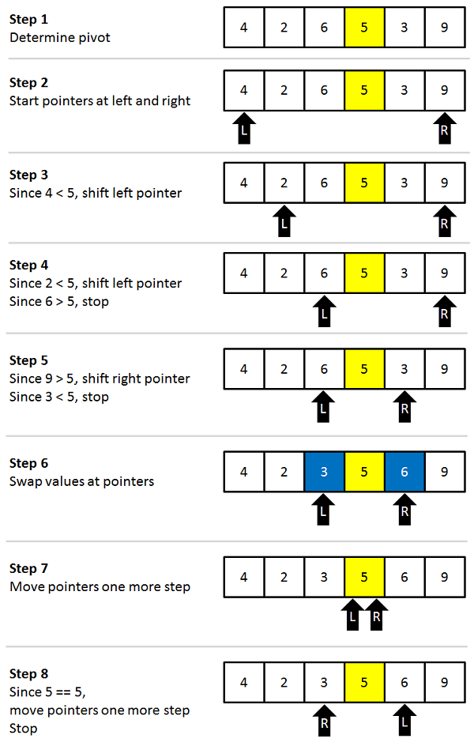

## 2. Quick Sort



### Idea

Quick Sort uses **divide and conquer**.

* Choose a **pivot**
* Partition array into:

  * Elements smaller than pivot
  * Elements greater than pivot
* Recursively sort both sides

### How it works

1. Pick a pivot (usually last or middle element)
2. Rearrange elements so smaller are on the left, larger on the right
3. Apply the same logic recursively

### Python Implementation

```python
def quick_sort(arr):
    if len(arr) <= 1:
        return arr

    pivot = arr[len(arr) // 2]

    left = [x for x in arr if x < pivot]
    middle = [x for x in arr if x == pivot]
    right = [x for x in arr if x > pivot]

    return quick_sort(left) + middle + quick_sort(right)
```

### Example

```python
arr = [10, 7, 8, 9, 1, 5]
print(quick_sort(arr))
# Output: [1, 5, 7, 8, 9, 10]
```

### Time & Space Complexity

| Case              | Complexity |
| ----------------- | ---------- |
| Best              | O(n log n) |
| Average           | O(n log n) |
| Worst (bad pivot) | O(n²)      |
| Space             | O(log n)   |
| Stable            | No       |
